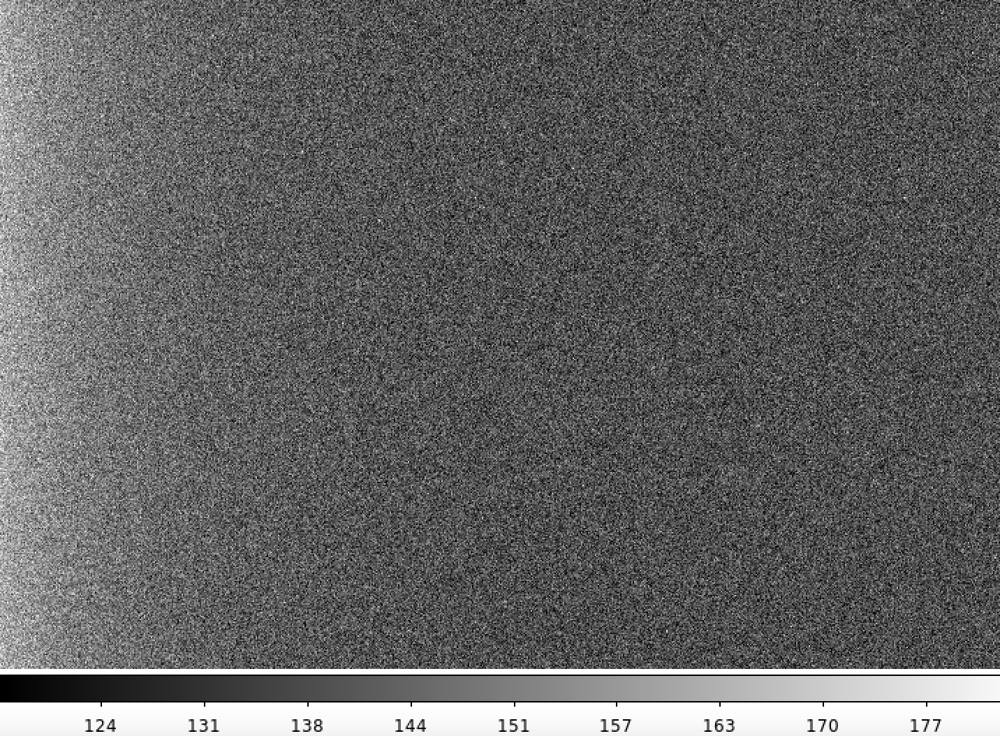

```{r setup, include=FALSE}
knitr::opts_chunk$set(echo = TRUE)
```

# Introduction

A colour-magnitude diagram, in astronomy, is a graph showing the relation between the absolute magnitudes (brightnesses) of stars and their colours, which are closely related to their temperatures and spectral types. It is similar to the Hertzsprung-Russell diagram except that the latter plots spectral types instead of colours.

Both a cluster’s age and its distance can be derived from such a diagram. 

## Data

Data was collected from the Philip Wetton Telescope (PWT) in Oxford to study the colour-magnitude diagram (CMD) and density of open stellar clusters


# Calibrating the Images

## Bias Frames

The bias frames are almost uniform black images. Shown below is the first bias frame (using the z scale) across a range of pixels. We observe that there is a slight gradient along the x-axis.

```{r echo=FALSE, out.width='50%'}

```


We increase the number of files used (from 1 to all 10) to calculate the mean bias value and standard deviation.

```{r bcd, echo=FALSE}
bcd <- read.csv("../data/bias_cumulative_data.csv")
library(knitr)
kable(bcd)
```


```{r bcd plot, echo = FALSE}
library(ggplot2)
p1 <- ggplot(bcd, aes(y = Mean.Bias.Value, x = Number.of.Bias.Files)) +
  geom_line()
p1 + ggtitle("Mean Bias Value as Number of Files Increase") +
  theme(plot.title = element_text(hjust = 0.5))

```


Mean
$\bar{x}=\frac{1}{N}\sum_{i=1}^N x_i$

Standard Deviation
$\sigma = \sqrt{\frac{1}{N-1}\sum_{i=1}^N(x_i-\bar{x})^2}$

Standard Error of the Mean
$\sigma_{\bar{x}} = \frac{\sigma}{\sqrt{N}}$


We note that for large N, $\sigma	\propto \frac{1}{\sqrt{N}}$


<!-- expfit = nls(y∼a*exp(b*x)+c, start = list(a=A, b=B, c=C), algorithm="port") -->


